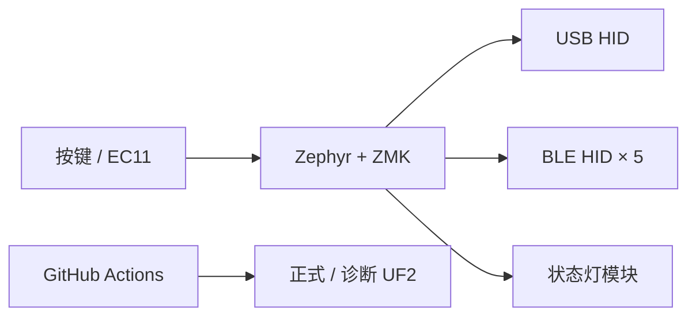

# GALPANEL

基于 nRF52840 + ZMK 的 GALGAME USB/BLE 双模控制器

> 实物照片占位，后续替换为成品照片与演示 GIF。

## 项目概述

GALPANEL 是一款围绕 GALGAME 操作设计的桌面控制器。项目覆盖 PCB、焊接、nRF52840 固件、USB/BLE HID、自动构建和实物验证，当前稳定版本为 `v2.1.1`。

## 核心功能

- USB HID + BLE HID 双模；
- 5 个独立 BLE Profile：`GALPANEL 1`～`GALPANEL 5`；
- 四个侧键按物理位置控制四条 45° 光标轨迹；
- EC11 旋钮控制鼠标滚轮，按压执行 `Win+D`；
- INFO、LINK、WARN、AUX 状态灯反馈；
- SYS 单击切 Profile、双击切 USB/BLE、长按清除当前 bond；
- GitHub Actions 自动生成正式与诊断 UF2。

## v2.1.1 键位

| 控件 | 功能 |
|---|---|
| D2 / D3 / D4 | Ctrl / Esc / Enter |
| D18 左上 | 光标左上 45° 移动 |
| D5 右上 | 光标右上 45° 移动 |
| D7 右下 | 光标右下 45° 移动 |
| D14 左下 | 光标左下 45° 移动 |
| EC11 旋转 / 按压 | 鼠标滚轮 / Win+D |
| D8 SYS | Profile、输出端点与 bond 管理 |

## 技术实现

技术栈：nRF52840、Zephyr、ZMK、Devicetree、Kconfig、C、GitHub Actions。

关键调试成果：

- 修复测试 shield 错误命中正式 keymap；
- 将 EC11 正确接入鼠标 HID，而不是键盘键值；
- 修复滚轮脉冲短于 ZMK 更新周期导致的无响应；
- 隔离并解决 Windows BLE bond、动态 Profile 名称与连接状态问题；
- 实现单键同时输出 X/Y 位移的 45° 光标控制。

## 下载与烧录

- `v2.1.0`：带 FN 层的原稳定版；
- `v2.1.1`：45° 光标控制版，当前推荐。

双击 RST，等待 `NICENANO` U 盘出现，将 Release 中的 UF2 复制进去即可。

## 文档

- [使用说明](使用说明.md)
- [项目认知](项目认知.md)
- [测试计划](测试计划.md)
- [学习日志](学习日志.md)
- [完整开发日志](galpanel.log.md)
- [稳定版本记录](稳定版本备份.md)

